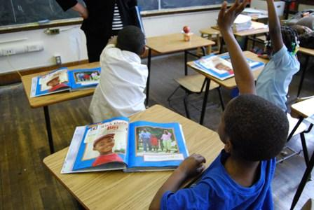

```{r setup, include=FALSE}

library(flexdashboard)
library(tidycensus)
library(tidyverse)
options(tigris_use_cache = TRUE)
library(ggplot2)
library(sf)
library(tmap)
library(viridis)
library(RColorBrewer)
library(devtools)
library(leaflet)
library(stringr)
library(highcharter)

detroit_population_change <- read_csv("detroit_population.csv")


census_api_key("2cb24b255d5b7f9ce4bc9f2ea6d0be84276786ff")
```
Rise and Fall and ...Rise {.storyboard}
==========================================================================================
  
### Child Well-Being in Michigan
  
  
#### The 2017 KIDS COUNT Data Book ranks Michigan 32nd in overall child well-being and last in the Midwest region. Compared to other states, children in Michigan rank low in both economic security and education. Due to structural and institutional barriers, kids and families of color experience disparate outcomes compared with their white counterparts.   

##### (_Source: Michigan League of Public Policy_)    

<center>

<center>


### There are distinct demarcations along race in Michigan.  
```{r race across the state}

# get race variables
race_vars <- c(White = "B02008_001",
               Black = "B02009_001",
               American_Indian = "B02010_001",
               Asian = "B02011_001")

mi_race <- get_acs(geography = "county",
                   variables = race_vars,
                   summary_var = "B01003_001", 
                   state = "MI",
                   geometry = TRUE)

# by race by county
mi_race %>%
  # percent total of each column
  mutate(percent_of_county_pop = 100 * (estimate / summary_est)) %>%
  # facet maps
  ggplot(aes(fill = percent_of_county_pop, color = percent_of_county_pop)) +
  theme(axis.text.x = element_blank(),
        axis.text.y = element_blank(),
        axis.ticks = element_blank(),
        rect = element_blank()) + 
  facet_wrap(~variable) +
  geom_sf() + 
    coord_sf(crs = 26915) + 
  scale_fill_viridis(option = "C") +
  scale_color_viridis(option = "C")
```  

*** 
#### __Race and Education__.  
##### In December 2017, Michigan Radio reported that schools in Michigan are among the most segregated in the US.   
##### A similar story in the "_Detroit News_" pointed out that high levels of segregation correspond with low achievement and fewer students, on average, reaching state standards for proficiency in reading and math. 
  
##### Concerned about children of color, the rest of this analysis will focus on at-risk indicators for children of color living in Detroit.  

##### _Source: <http://michiganradio.org/post/report-michigan-schools-second-most-segregated-nation>_

  
  
### Detroit has suffered a huge decrease in population, leaving the city in urban decay. This has impacted mostly families and children of color. 
```{r change in pop}

highchart() %>%
  hc_xAxis(categories = detroit_population_change$census) %>%
  hc_add_series(name = "population", data = detroit_population_change$population)

```  

*** 
####__Shrinking City__. 
##### The president of the Michigan Association of Public School Academies says the lack of diversity in the schools is a reflection of where people are living.  
##### Detroit has seen a dramatic decline in population over the past 60 years. This is largely due to 'white flight', or the exodus of white families from cities to suburbs.  
##### These economic and social issues go beyond the segregated school systems, and, as Detroit begins to rebuild itself, these issues need to be addressed head on.   

### Within Detroit, minority and majority populations are not evenly distributed. 
```{r non white}

# social vulnerability index variables
vul_vars <- c("B17001_001", "B17001_002", "B02001_001", "B02001_002", "B01001_003","B01001_004", "B01001_005", "B01001_006", "B01001_027","B01001_028", "B01001_029", "B01001_030", "B23008_007", "B23008_011", "B23008_014", "B23008_020", "B23008_024", "B23008_027")

# data for wayne county
detroit_vul <- get_acs(geography = "tract", 
                       variables = vul_vars,
                       state = "MI",
                       county = "Wayne", 
                       output = "wide",
                       geometry = TRUE)

detroit_vul <- detroit_vul %>%
  mutate(CountyFIPS = str_sub(GEOID, 1, 5))

# calculate percentages and rename variables
detroit_vul_clean <- detroit_vul %>%
  mutate(pov_share = 100* (B17001_002E/B17001_001E),
         non_white = 100* ((B02001_001E-B02001_002E)/B02001_001E),
         males0_17 = (B01001_003E + B01001_004E + B01001_005E + B01001_006E),
         females0_17 = (B01001_027E + B01001_028E + B01001_029E + B01001_030E),
         pop_under_17 = 100* ((males0_17 + females0_17)/B02001_001E),
         unemployed_with_children = 100* (B23008_007E + B23008_011E + B23008_014E + B23008_020E + B23008_024E + B23008_027E)/B02001_001E) %>%
  select(NAME, GEOID, CountyFIPS, pov_share, non_white, pop_under_17, unemployed_with_children)

# distribution of nonwhite
pal_nonwhite <- colorNumeric(palette = "plasma", domain = detroit_vul_clean$non_white)

detroit_vul_clean %>%
  st_transform(crs = "+init=epsg:4326") %>%
  leaflet(width = "100%") %>%
  addProviderTiles(provider = "CartoDB.Positron") %>%
  addPolygons(popup = ~str_extract(NAME, "^([^,]*)"),
              stroke = FALSE,
              smoothFactor = 0,
              fillOpacity = 0.5,
              color = ~pal_nonwhite(non_white)) %>%
  addLegend("bottomright",
            pal = pal_nonwhite,
            values = ~ non_white,
            title = "Non-White Households",
            labFormat = labelFormat(suffix = "%"), 
            opacity = 1)
```

*** 
#### __White Flight.__

#### The decline in Detroit's population is largely due to the exodus of white families. Today, we see a considerable clustering of non-white households around Detroit. 


### Detroit has seen a decline in the percentage of people living in poverty, though the city's poverty rate has remained higher than both the state and national average.  
```{r poverty}

# distribution of poverty
pal_pov <- colorNumeric(palette = "plasma", domain = detroit_vul_clean$pov_share)

detroit_vul_clean %>%
  st_transform(crs = "+init=epsg:4326") %>%
  leaflet(width = "100%") %>%
  addProviderTiles(provider = "CartoDB.Positron") %>%
  addPolygons(popup = ~str_extract(NAME, "^([^,]*)"),
              stroke = FALSE,
              smoothFactor = 0,
              fillOpacity = 0.5,
              color = ~pal_pov(pov_share)) %>%
  addLegend("bottomright",
            pal = pal_pov,
            values = ~ pov_share,
            title = "Low-Income Households",
            labFormat = labelFormat(suffix = "%"),
            opacity = 1)

```

*** 
#### __High Rates of Poverty.__    
##### Detroit is one of the most impoverished cities with approximately 39.3% living below a poverty line of $24,008 for a family of four. The economic recovery has not had an impact on poverty or wage levels across the state. 

##### _Source: <https://www.detroitnews.com/story/news/local/michigan/2015/09/16/census-us-uninsured-drops-income-stagnates/32499231/>_
  
 

  
### Those economically challenged households cluster around the city of Detroit. 
```{r children and unemployment}

# unemployed parents
pal_children <- colorNumeric(palette = "plasma", domain = detroit_vul_clean$unemployed_with_children)

detroit_vul_clean %>%
  st_transform(crs = "+init=epsg:4326") %>%
  leaflet(width = "100%") %>%
  addProviderTiles(provider = "CartoDB.Positron") %>%
  addPolygons(popup = ~str_extract(NAME, "^([^,]*)"),
              stroke = FALSE,
              smoothFactor = 0,
              fillOpacity = 0.5,
              color = ~pal_children(unemployed_with_children)) %>%
  addLegend("bottomright",
            pal = pal_children,
            values = ~ unemployed_with_children,
            title = "Families Without Secure Employment",
            labFormat = labelFormat(suffix = "%"),
            opacity = 1)
```

*** 
####__Dependents.__ 

##### Children, dependent on parents and families, have minimal autonomy, and, therefore are vulnerable to their existing environment and circumstances. The unemployment of parents has been shown to have negative effects on children in both the short- and long-term. 
  
  
### Amidst its rejuvenation, the inclusion of the city's most vulnerable groups is vital to ensure the future success of Detroit.  
```{r vulnerability index}

# z-scores for each vulnerability variable
detroit_vul_clean <- detroit_vul_clean %>%
  mutate(
    pov_z = (pov_share - mean(pov_share, na.rm = TRUE))/sd(pov_share, na.rm = TRUE),
    non_white_z = (non_white - mean(non_white, na.rm = TRUE))/sd(non_white, na.rm = TRUE),
    pop_under_17_z = (pop_under_17 - mean(pop_under_17, na.rm = TRUE))/sd(pop_under_17, na.rm = TRUE),
    unemployed_z = (unemployed_with_children - mean(unemployed_with_children, na.rm = TRUE))/sd(unemployed_with_children, na.rm = TRUE)
  )

detroit_vul_clean <- detroit_vul_clean %>%
  mutate(vul_index = (pov_z + non_white_z + pop_under_17_z + unemployed_z)/4) %>%
  select(GEOID, NAME, CountyFIPS, pov_z, non_white_z, pop_under_17_z, unemployed_z, vul_index)

# map of vulnerability index 
pal_vul <- colorNumeric(palette = "viridis", domain = detroit_vul_clean$vul_index)

detroit_vul_clean %>%
  st_transform(crs = "+init=epsg:4326") %>%
  leaflet(width = "100%") %>%
  addProviderTiles(provider = "CartoDB.Positron") %>%
  addPolygons(popup = ~str_extract(NAME, "^([^,]*)"),
              stroke = FALSE,
              smoothFactor = 0,
              fillOpacity = 0.5,
              color = ~pal_vul(vul_index)) %>%
  addLegend("bottomright",
            pal = pal_vul,
            values = ~ vul_index,
            title = "vulnerability index",
            opacity = 1)
```

*** 
#### __At Risk Index.__   
##### The index includes standardized measures of those demographic characteristics shown previously - low-income households, non-white population, children under the age of 17, and families with unemployed parents.
  
##### The goal of this analysis is to show the areas in which the most at-risk children are living in the city of Detroit. Green and yellow tracts represent areas that have an index score 1.5 and 2.5 standard deviations above the mean. Or, in other words, areas with above average rates of at-risk children.
  
##### While Detroit continues to rebuild, both the city and the state of Michigan need to continue to invest in improvements to the child care system and expand investments in adult education and workforce development for parents.   

